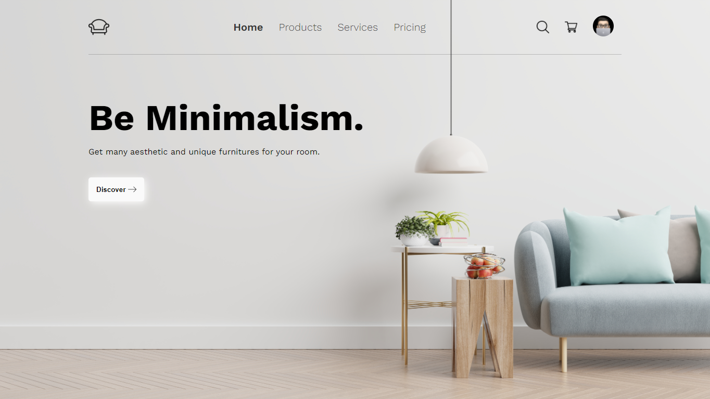

<p align="center">
    
</p>

# Minimal One Page
> Clean and Minimalistic One Page Template.

this open source project was made for studies. <br />
Be sure to send your feedback.

## Technology stack

* **Front-end:** [React.Js](https://reactjs.org/)
* **Deployment:** [Vercel](https://vercel.com/)
* **Build:** [Vite](https://vitejs.dev/)

## Test Online
[Click Here](https://furniture-iamdevmarcos.vercel.app/)

## Running locally

1. Clone this repo:

```sh
$ git clone https://github.com/iamdevmarcos/minimal-one-page-template.git
```

2. Then go to the project's folder:

```sh
cd macOS
```

3. Install all dependencies:

```sh
npm install
```

4. Run locally:

```sh
npm run dev
```

## Autor

| [<br><sub>@iamdevmarcos</sub>](https://github.com/iamdevmarcos) |
| :---: |